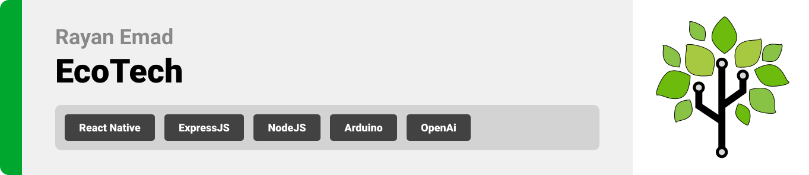 
<br><br> 

 


- [Project Philosophy](#project-description)
  - [User Types](#user-types)
- [Prototyping](#prototyping)
- [Tech Stack](#tech-stack)
  - [Frontend](#Frontend)
  - [Backend](#Backend)
- [Demo](#Demo)
- [OpenAi](#OpenAi)
- [Performance](#Performance)
- [How to Run](#how-to-run)
  - [Prerequisites](#prerequisites)
  - [Installation](#installation)


<br><br>  

<!-- Project Description -->
<a name="project-description"></a>
 
> The aim of the EcoTech project is to develop a comprehensive application that harnesses various technologies to help prevent and alert forest guards about potential wildfire outbreaks. 
<br>


EcoTech's primary goal is to enhance forest safety by collecting vital data such as temperature, humidity, and other factors that can indicate a wildfire. This data is gathered through sensors connected to an Arduino and sent to an AI system that predicts potential fire outbreaks. If a threat is detected, the app sends real-time notifications to nearby firefighting stations and forest guards, enabling prompt and efficient response. The user base for this application includes firefighters, forest guards, and environmentally-conscious individuals committed to safeguarding forests and wildlife. 

In addition to its critical wildfire prevention functionality, EcoTech offers a unique feature that promotes community engagement in reforestation efforts. Users can view a map displaying the locations of forest sensors. 

Potential challenges for EcoTech include ensuring accurate and timely data collection and analysis, securing funding for sensor installation and maintenance, and fostering user engagement for the tree-planting feature. 

<br>

### User Types 

1. Admin 
2. General Users (Environmentally-conscious individuals)


<br>

### Features of the App 

As an Admin: 

- Create and maintain Arduino connection and configuration. 
- Receive real-time notifications of potential wildfire outbreaks for early prevention.   
- Monitor live data from various forest sensors to understand the current forest conditions. 
- Receive information about the fire risk in particular areas. 

As a General User, I want to: 

- View the locations of forest sensors to understand where monitoring is taking place. 
- Receive real-time notifications of potential wildfire outbreaks for early prevention. 
- Receive information about the fire risk in particular areas. 

<br><br> 

 
<a name="prototyping"></a>

> We designed EcoTech using wireframes and mockups using Figma, iterating on the design to ensure easy navigation and a seamless user experience.
<br>


| Login  | Sign up-1 | Sign up-2 | Sign up-3 | Sign up-4 | 
| ---| ---| ---| ---| ---|
| 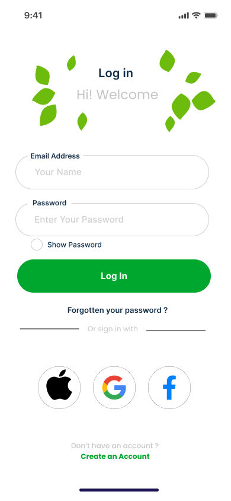 | 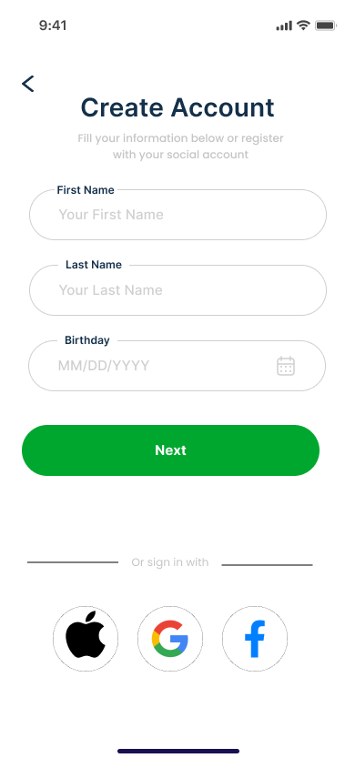  | 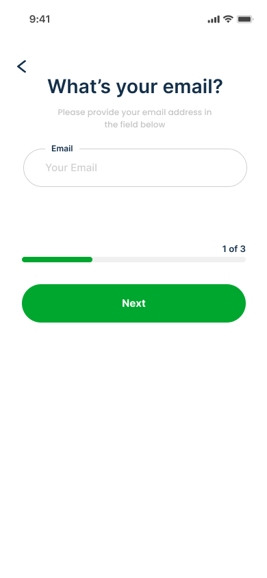 | 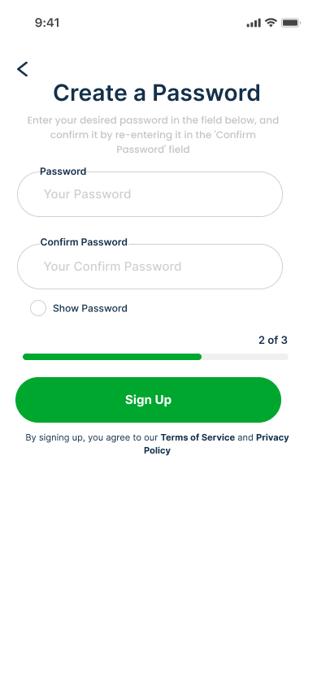 |  | 
| Map  | Weather Widgets | Statistics | Settings | Profile | 
| ---| ---| ---| ---| ---|
| 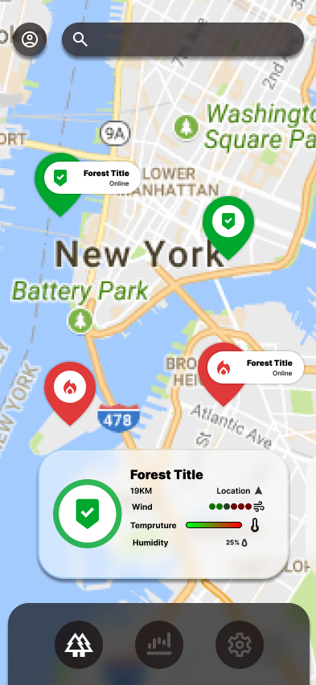 | 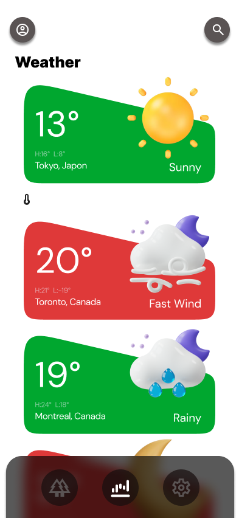  | 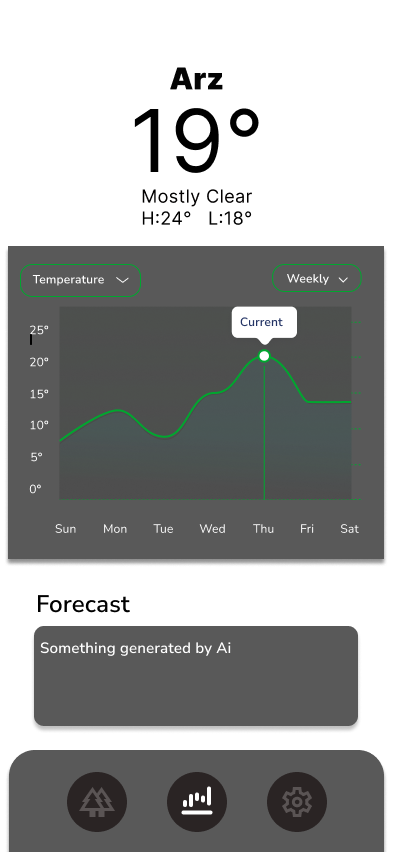 | 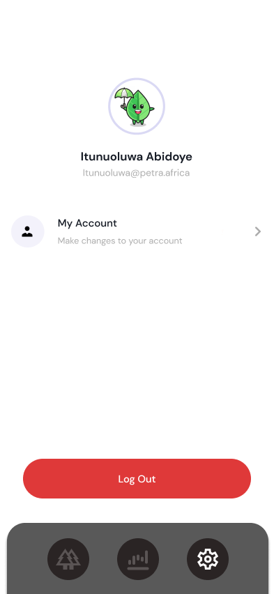 | 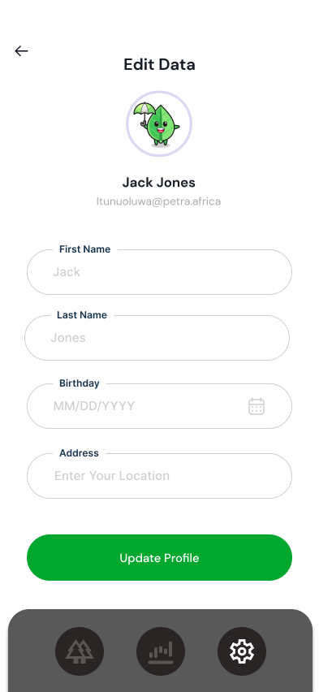 | 

<br><br> 

<a name="tech-stack" ></a>

> The application utilizes React Native (Expo) for the mobile app, Node.js with Express for the backend, MongoDB Atlas for database storage, AWS server for cloud infrastructure, Arduino for sensor data collection, OpenAI for predictive analytics, and Firebase for real-time notifications. 
<br>

EcoTech is built using the following technologies: 

## Frontend (Mobile App)
<a name="Frontend" ></a>
- **React Native (Expo):** Used for cross-platform mobile app development.
- **Expo Packages:** Various Expo packages for accessing device features and UI components.
- **React Navigation:** Handles navigation within the app.
- **Redux:** Manages app data and state effectively.
- **Expo Notifications:** Handles push notifications.
- **Axios:** Enables network requests to the backend.

<br>

## Backend (Server)
<a name="Backend" ></a>
- **Node.js with Express:** Powers the backend server for API requests and logic.
- **MongoDB Atlas:** Cloud-based database service for data storage.
- **AWS (Amazon Web Services):** Cloud infrastructure for hosting the server and application.
- **Arduino:** Utilized for sensor data collection in the field.
- **OpenAI:** Empowers predictive analytics and AI capabilities.
- **Native Notify:** Used for real-time notifications.
- **Express Rate Limit:** Middleware for rate limiting API requests.
- **Joi:** Data validation library.
- **Jsonwebtoken:** Manages JSON Web Tokens (JWT) for authentication.
- **Mailgen:** Generates email content.
- **Mongoose:** Object Data Modeling (ODM) library for MongoDB.
- **Nodemailer:** Handles email sending.

EcoTech utilizes these technologies to provide a seamless and comprehensive wildfire prevention and community engagement experience. 

<br><br> 


<a name="Demo" ></a>

> Based on the wireframes and mockups, we implemented the EcoTech app with the following features: 
<br>

### Screens 

| Register  | Map | Statistic | Profile | Push Notification | 
| ---| ---| ---| ---| ---|
|  |   |  |  |  | 

### Admin Screen

| Create Forest |
---|
|  |


### Arduino

| Circuit Diagram | 
---|
| 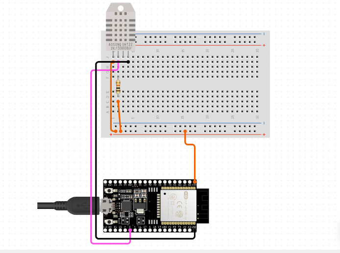 |
<br>

Circuit Design |
---| 
 | 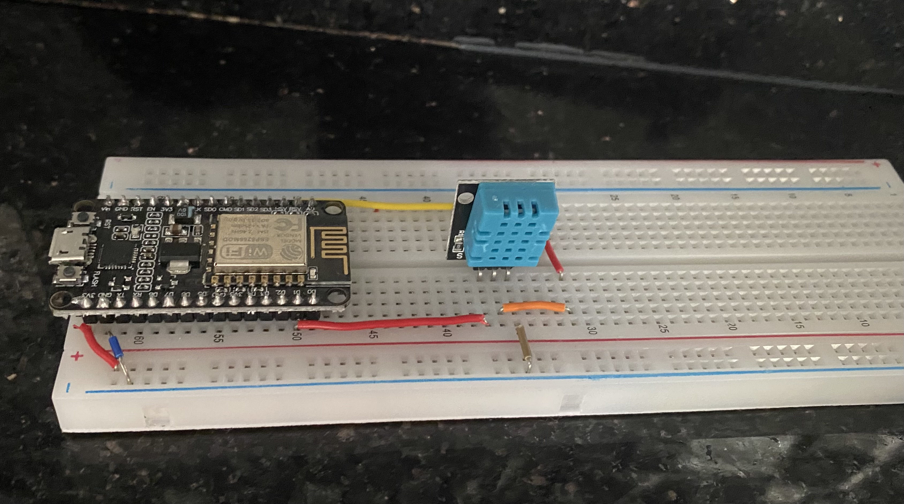 |


<br><br> 

<a name="OpenAi" ></a>

<br>

 
Before prediction:
```sh
{
  forestId: '650feb23594bb545d4cdd338',
  temperature: [ { value: 17.5, hour: 10, day: 4, source: 'real' } ],
  humidity: [ { value: 35, hour: 10, day: 4, source: 'real' } ]
}
```
<br>

After prediction: 
```sh 
  {
  forestId: '650feb23594bb545d4cdd338',
  temperature: [
    { value: 17.5, hour: 10, day: 4, source: 'real' },
    { value: 18.2, hour: 11, day: 4, source: 'predicted' },
    { value: 19.1, hour: 12, day: 4, source: 'predicted' }
  ],
  humidity: [
    { value: 35, hour: 10, day: 4, source: 'real' },
    { value: 33, hour: 11, day: 4, source: 'predicted' },
    { value: 32, hour: 12, day: 4, source: 'predicted' }
  ],
  forecast: 'The forecast for the next two hours is warmer temperatures and lower humidity. The temperature is expected to reach a high of 19.1°C, with a humidity of 32%. Conditions are expected to be sunny.',
  fire_alarm: false,
  condition: 'sunny'
}

```

<br><br> 


<a name="Performance" ></a>
 
> The following tests were conducted in Postman to assess the functionality of my application's primary APIs
<br>

URL: http://63.35.223.98:8080/user/get_forests

```sh 
PASS: Response time is within acceptable range //199 ms
PASS: Response content type is JSON
PASS: Response schema is valid
PASS: Response has the required field - message
PASS: Response content type is JSON

```

<br>
URL: http://63.35.223.98:8080/user/get_forest_data

```sh 
PASS: Response time is within acceptable range //258 ms
PASS: Response content type is JSON
PASS: Response schema is valid
PASS: Response has the required field - message
PASS: Response content type is JSON
```
<br>
URL: http://63.35.223.98:8080/forest/update-forest-data

```sh 
FAIL: Response time is within acceptable range | AssertionError: Response time should be below 1000ms: expected 6938 to be below 1000
PASS: Response content type is JSON
PASS: Response schema is valid
PASS: Response has the required field - message
PASS: Response content type is JSON
```
<span style="font-size: 12px;">Note: This API isn't for regular user interactions; it uses unique logic, including OpenAI integration and array searching, for forest updates.</span>


<br><br> 


<a name="how-to-run" ></a>
 
> To set up EcoTech locally, follow these steps: 
<br>

### Prerequisites 
<br>
Ensure you have the following software and dependencies installed: 

1. Node.js and npm (Node Package Manager). You can install them from [nodejs.org](https://nodejs.org/). 
2. Expo CLI for React Native. You can install it globally using the command: 

```sh 
npm install -g expo-cli 
```
3. Clone the GitHub repository: 

```sh 
git clone https://github.com/Rayan-Emad1/EcoTech  
```

<br>

### Installation 

<br>

#### Frontend (Mobile App) 


1. Navigate to the `client` directory: 

   ```bash  
   cd EcoTech/client 
   ``` 
2. Install dependencies:  

   ```bash  
     npm install 
   ``` 
3. Start development server: 

   ```bash  
   npx expo start  
   ``` 
<br>

#### Backend (Server) 

1. Navigate to the `server` directory: 

   ```bash 
   cd EcoTech/server 
   ``` 

2. Install dependencies: 

   ```bash   
   npm install 
   ```  

3. Create a `.env` file with your credentials

   ```bash  
   cp .env.example .env
   ``` 
  
4. Start the server: 

   ```bash 
   npm run start 
   ``` 

Now you can run the app locally and test out its features. Make sure to run both frontend and backend concurrently. 
